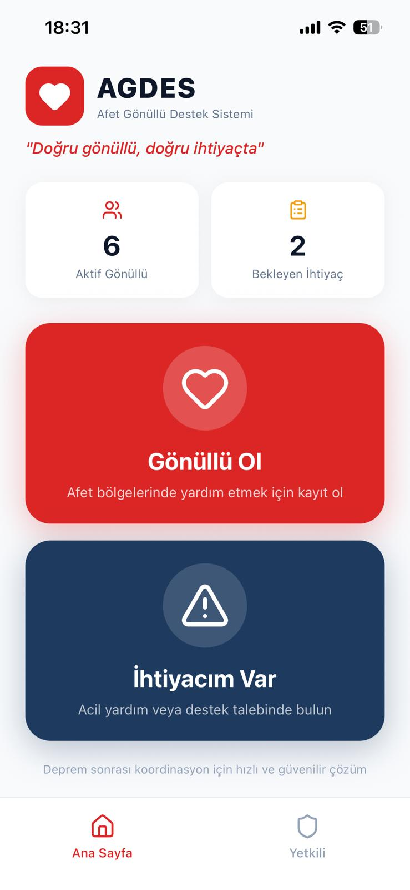
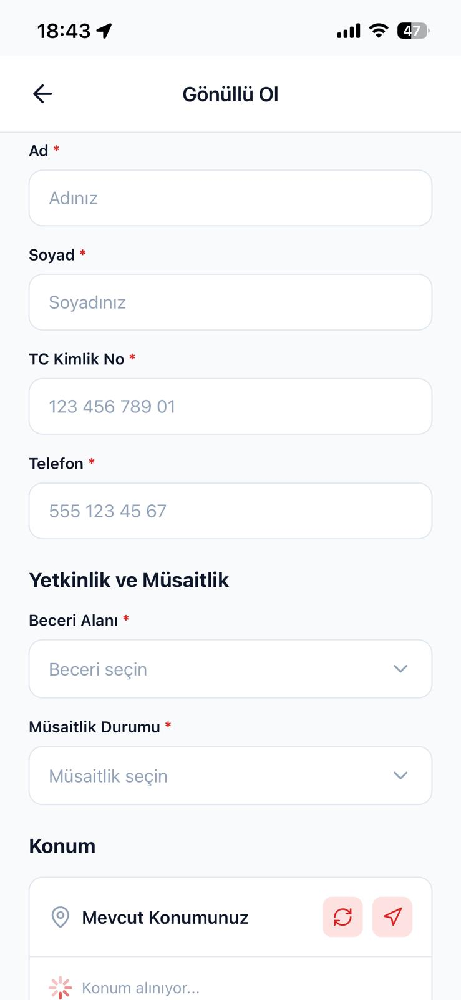
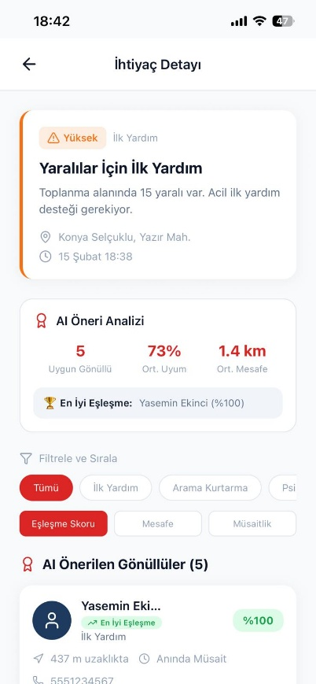
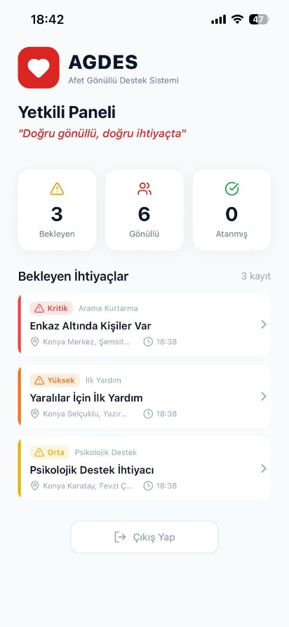

**Dil / Language:** [🇹🇷 Türkçe](#türkçe) · [🇬🇧 English](#english)

---

<a name="türkçe"></a>

# AGDES — Afet Gönüllü Destek Sistemi

AGDES, afet bölgelerinde gönüllüleri ihtiyaç sahipleriyle koordineli şekilde buluşturan bir mobil ve web platformudur. Yetenek, mesafe ve müsaitliği birlikte değerlendiren akıllı eşleştirme algoritması ile doğru gönüllüyü doğru ihtiyaca yönlendirir. iOS, Android ve Web üzerinde çalışır.

---

## Teknolojiler

- **React Native** + **Expo** 
- **Expo Router**
- **TypeScript**
- **React Context API** + **TanStack Query**
- **Expo Location**
- **Lucide React Native**

---

## Özellikler

- Gönüllü kaydı (yetenek, müsaitlik, GPS konum)
- Aciliyet seviyeli (1–5) ihtiyaç bildirimi
- Akıllı gönüllü–ihtiyaç eşleştirme (yetenek %50, mesafe %30, müsaitlik %20)
- Yönetici paneli — bekleyen ihtiyaçlar, atama ve istatistikler
- Çok platform desteği — iOS, Android, Web

---

## Süreç

Proje, afet koordinasyonundaki en kritik soruna odaklanır: **doğru kişiyi, doğru yere, doğru zamanda ulaştırmak.** Bunun için önce temel rol akışları (gönüllü, ihtiyaç sahibi, yönetici) tanımlandı. Ardından Haversine formülü tabanlı mesafe hesabı ve yetenek eşleştirmesini birleştiren ağırlıklı bir skorlama sistemi geliştirildi. Arayüz kasıtlı olarak sade tutuldu; stresli afet ortamında hızlı kullanım ön planda.

---

## Projeyi Çalıştırma

```bash
# Bağımlılıkları yükle
npm install

# Geliştirme sunucusunu başlat
npm start

# Web için
npm run start-web
```

---

## Önizleme

| Ana Sayfa & Navigasyon | Gönüllü Formu | Öneri Analizi | Yetkili Paneli |
| :---: | :---: | :---: | :---: |
|  |  |  |  |

---
---

<a name="english"></a>

# AGDES — Disaster Volunteer Support System

AGDES is a mobile and web platform that coordinates volunteers with people in need in disaster zones. Its intelligent matching algorithm evaluates skill, distance, and availability together to connect the right volunteer to the right need. Runs on iOS, Android, and Web.

---

## Technologies

- **React Native** + **Expo**
- **Expo Router**
- **TypeScript**
- **React Context API** + **TanStack Query**
- **Expo Location**
- **Lucide React Native**

---

## Features

- Volunteer registration (skill, availability, GPS location)
- Urgency-graded (1–5) need reporting
- Smart volunteer–need matching (skill 50%, distance 30%, availability 20%)
- Admin dashboard — pending needs, assignment, and statistics
- Multi-platform support — iOS, Android, Web

---

## The Process

The project focuses on the most critical problem in disaster coordination: **getting the right person to the right place at the right time.** To solve this, the core role flows (volunteer, person in need, admin) were defined first. A weighted scoring system combining Haversine-based distance calculation and skill matching was then developed. The interface was intentionally kept minimal to prioritize fast use in high-stress disaster environments.

---

## Running the Project

```bash
# Install dependencies
npm install

# Start the development server
npm start

# For web
npm run start-web
```

---

## Preview

### 📱 Interface Preview | Arayüz Önizleme

| Home & Navigation | Volunteer Form | Matching | Admin Dashboard |
| :---: | :---: | :---: | :---: |
|  |  |  |  |